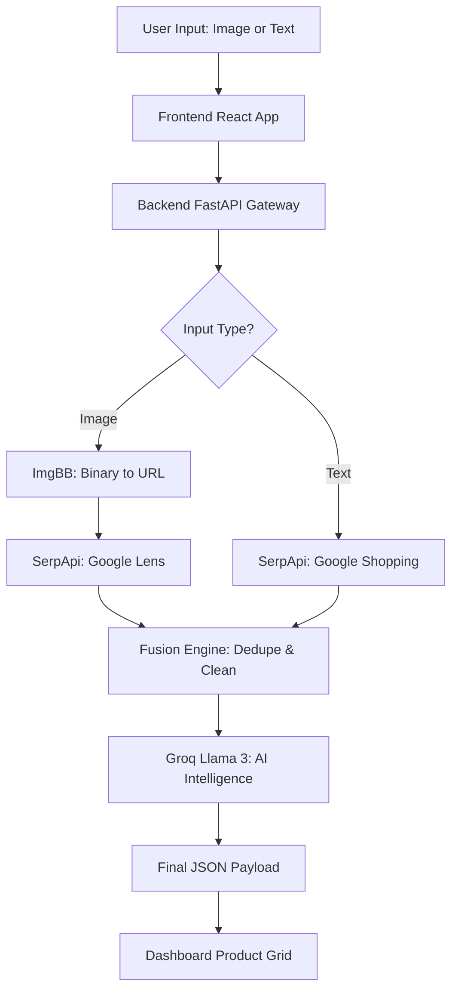
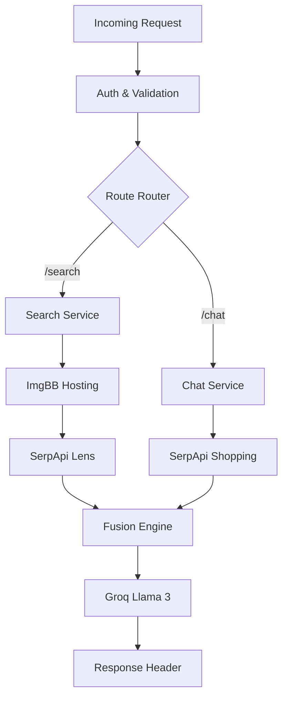
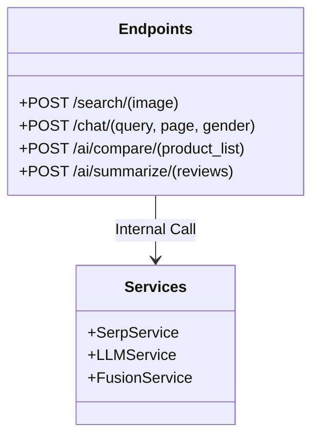
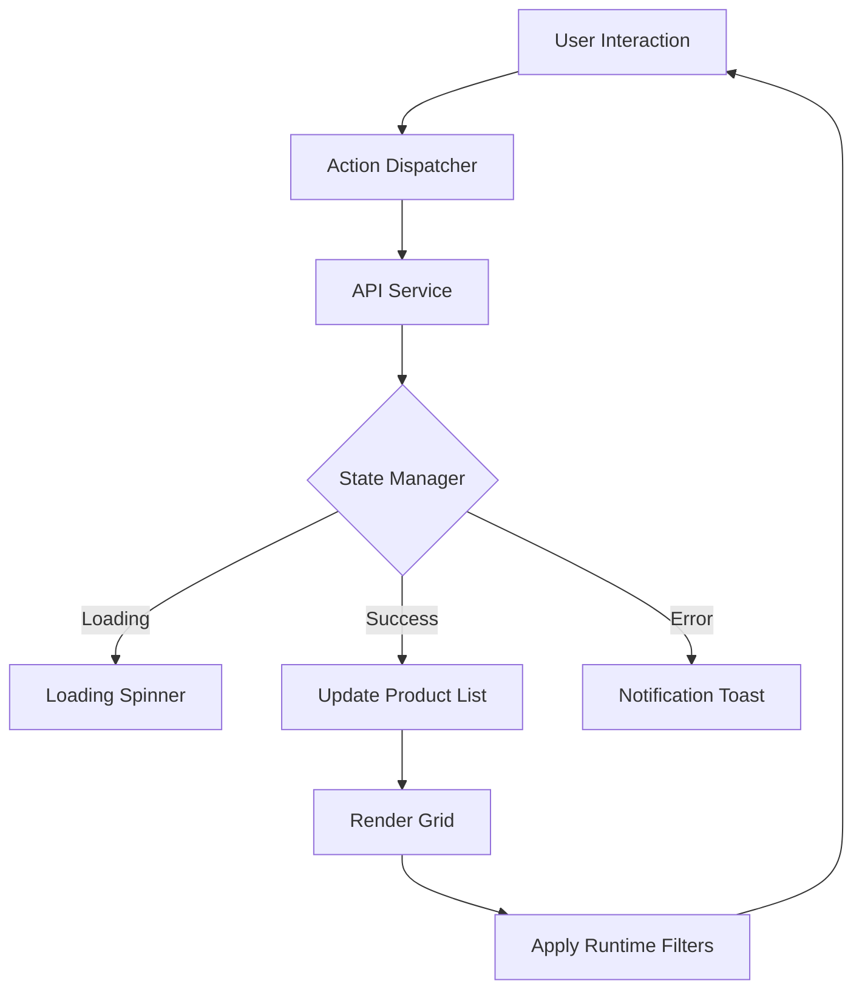

# 1. Full System 

```mermaid
graph TD
    USER[User Input: Image or Text] --> FRONT[Frontend React App]
    FRONT --> BACK[Backend FastAPI Gateway]
    
    BACK --> TYPE{Input Type?}
    
    TYPE -->|Image| IBB[ImgBB: Binary to URL]
    IBB --> LENS[SerpApi: Google Lens]
    LENS --> FUSION
    
    TYPE -->|Text| SHOP[SerpApi: Google Shopping]
    SHOP --> FUSION[Fusion Engine: Dedupe & Clean]
    
    FUSION --> AI[Groq Llama 3: AI Intelligence]
    AI --> RESP[Final JSON Payload]
    RESP --> UI[Dashboard Product Grid]
```

# 2. Backend System 

```mermaid
graph TD
    REQ[Incoming Request] --> VAL[Auth & Validation]
    VAL --> ROUTE{Route Router}
    
    ROUTE -->|/search| SCH[Search Service]
    ROUTE -->|/chat| CHT[Chat Service]
    
    SCH --> IBB[ImgBB Hosting]
    IBB --> SLNS[SerpApi Lens]
    SLNS --> FUS[Fusion Engine]
    
    CHT --> SHOP[SerpApi Shopping]
    SHOP --> FUS
    
    FUS --> AI[Groq Llama 3]
    AI --> RESP[Response Header]
```

# 3. API Endpoint 

```mermaid
classDiagram
    class Endpoints {
        +POST /search/ (image)
        +POST /chat/ (query, page, gender)
        +POST /ai/compare/ (product_list)
        +POST /ai/summarize/ (reviews)
    }
    class Services {
        +SerpService
        +LLMService
        +FusionService
    }
    Endpoints --> Services : Internal Call
```

# 4. Frontend 

```mermaid
graph TD
    VIEW[User Interaction] --> DISP[Action Dispatcher]
    DISP --> API[API Service]
    API --> STATE{State Manager}
    
    STATE -->|Loading| SPIN[Loading Spinner]
    STATE -->|Success| DATA[Update Product List]
    STATE -->|Error| NOTIF[Notification Toast]
    
    DATA --> GRID[Render Grid]
    GRID --> FILT[Apply Runtime Filters]
    FILT --> VIEW
```