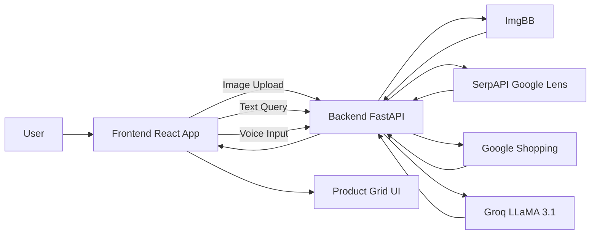
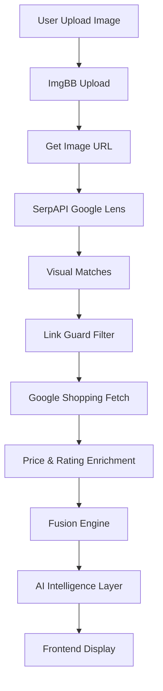

# ShopSight AI – Full Architecture Guide

---

# 1. System Overview

ShopSight AI is a **multimodal AI-powered shopping copilot** that allows users to discover products using:

* 📸 Image (Visual Search)
* 💬 Text (AI Chat Filtering)
* 🎙️ Voice (Speech Input)

The system combines:

* Real-time product retrieval (SerpAPI)
* Image hosting (ImgBB)
* AI reasoning (Groq – LLaMA 3.1)
* Advanced filtering & deduplication

---

# 2. High-Level Architecture



---

# 3. Frontend Architecture 

## Structure

```
frontend/
 ├── src/
 │   ├── components/
 │   │   ├── UploadBox.js
 │   │   ├── ChatBox.js
 │   │   ├── VoiceInput.js
 │   │   ├── ProductGrid.js
 │   │   ├── ProductCard.js
 │   │   └── Notification.js
 │   ├── pages/
 │   │   ├── LandingPage.js
 │   │   └── Dashboard.js
 │   ├── services/
 │   │   └── api.js
 │   └── App.js
```

## Key Features

* Brutalist UI (Anton font + high contrast)
* Custom notification system (no alert())
* Dense product grid layout
* Continuous scroll (LOAD_MORE_SIGHTS)
* Multimodal input support

---

# 4. Backend Architecture 

## Structure

```
backend/
 ├── app/
 │   ├── main.py
 │   ├── routes/
 │   │   ├── search.py
 │   │   ├── chat.py
 │   │   └── voice.py
 │   ├── services/
 │   │   ├── image_service.py
 │   │   ├── serp_service.py
 │   │   ├── filter_service.py
 │   │   ├── ai_service.py
 │   │   └── fusion_service.py
 │   └── utils/
 │       └── helpers.py
```

---

# 5. API Endpoints

| Endpoint | Method | Description               |
| -------- | ------ | ------------------------- |
| /search/ | POST   | Image → product discovery |
| /chat/   | POST   | AI filtering & refinement |
| /voice/  | POST   | Voice → text → query      |

---

# 6. Core System Flow



---

# 7. Deep Discovery Engine

### Link Guard System

* Removes duplicate product links
* Preserves multi-store pricing

### Category Re-Search

* Male / Female / Kids triggers new API calls
* Not just UI filtering

### Smart Diversification

* Injects keywords automatically
* Ensures product variety

---

# 8. Functional Workflow

### Image Search Flow

1. Upload image
2. Upload to ImgBB
3. Get image URL
4. Send to Google Lens
5. Extract matches
6. Remove junk/duplicates
7. Fetch pricing
8. Merge results
9. AI enhancement
10. Return results

---

# 9. Environment Configuration

## .env

```
SERP_API_KEY=your_key
IMGBB_API_KEY=your_key
GROQ_API_KEY=your_key
```

---

# 10. Setup Instructions

## Backend

```bash
python -m venv venv
venv\Scripts\activate
pip install -r requirements.txt
uvicorn app.main:app --reload
```

## Frontend

```bash
npm install
npm start
```

---