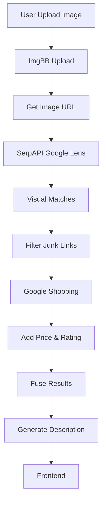

# ShopSight AI – Architecture Guide

## 1. API Endpoints

| Endpoint | Method | Description                          |
| -------- | ------ | ------------------------------------ |
| /search/ | POST   | Upload image and get product results |
| /chat/   | POST   | Chat with AI assistant               |
| /voice/  | POST   | Voice interaction                    |

---

## 2. System Flow (Mermaid)



---

## 3. Logic Flow

1. Upload image
2. Upload to ImgBB
3. Get image URL
4. Send to Google Lens
5. Get similar products
6. Filter unwanted links
7. Fetch price & rating
8. Merge results
9. Generate description
10. Return response

---

## 4. How to Start

### Create Environment

```bash
python -m venv venv
```

### Activate

```bash
venv\\Scripts\\activate
```

### .env File

```
SERP_API_KEY=your_key
IMGBB_API_KEY=your_key
GROQ_API_KEY=your_key
```

### Run

```bash
uvicorn app.main:app --reload
```

---