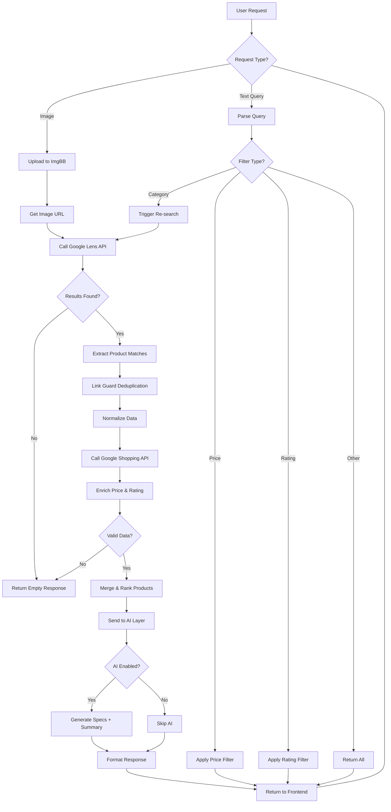

# ShopSight AI – Backend Models & Processing Architecture

---

# 1. Models Used 

| Model / Method            | Type          | Purpose                  | Status    | Description                           |
| ------------------------- | ------------- | ------------------------ | --------- | ------------------------------------- |
| Gemini 2.5 Flash          | Vision AI     | Image → product name     | ❌ Removed | Unstable, quota issues, added latency |
| OpenAI Vision             | Vision AI     | Image understanding      | ❌ Removed | High cost, unnecessary complexity     |
| Google Lens (SerpAPI)     | Search Engine | Image → similar products | ✅ Active  | Core discovery engine                 |
| Google Shopping (SerpAPI) | Search Engine | Price + rating           | ✅ Active  | Enrichment layer                      |
| Groq (LLaMA 3.1 8B)       | LLM           | AI reasoning & insights  | ✅ Active  | Generates descriptions & intelligence |

---

# 2. Final Backend Stack

| Layer             | Tool / Model          |
| ----------------- | --------------------- |
| Image Processing  | ImgBB                 |
| Visual Search     | Google Lens (SerpAPI) |
| Data Enrichment   | Google Shopping       |
| AI Intelligence   | Groq LLaMA 3.1        |
| Backend Framework | FastAPI               |

---

# 3. Backend Processing Flow

---

# 4. Accuracy Reality Check

| Method                       | Accuracy |
| ---------------------------- | -------- |
| Google Lens                  | ❌ 50–70% |
| Vision Model (Gemini/OpenAI) | ✅ 90–95% |

---

# 5. Final System Accuracy

| Component        | Accuracy |
| ---------------- | -------- |
| Product Matching | ~60–70%  |
| Price Accuracy   | ~80–90%  |
| Rating Accuracy  | ~80–90%  |

---