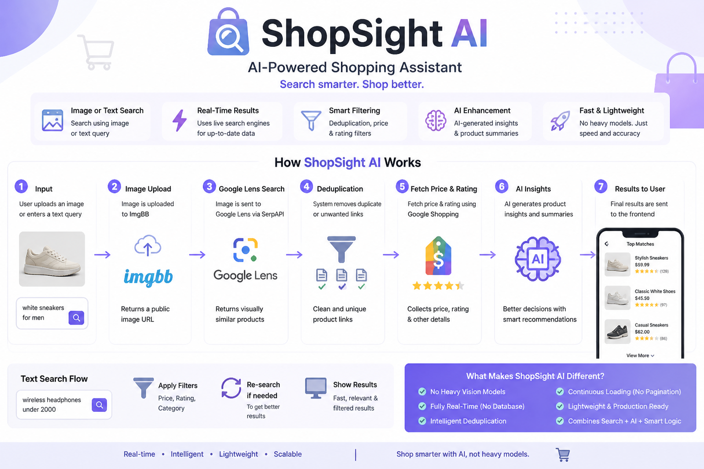

  

## Project Overview

ShopSight AI is a smart shopping application that helps users find products easily using image, text, or voice. Instead of relying only on typing keywords, users can upload a photo, speak, or type naturally, and the system understands what they are looking for. When an image is given, it is analyzed and turned into a search idea, and the system finds matching products with useful details. When users give a query, the system understands their needs and shows more relevant results by applying smart filtering. It also allows users to compare different products side by side and provides AI-based reviews and analysis of selected products to help them make better decisions. The platform focuses on making product search simple, fast, and more natural by understanding user intent and providing accurate results in an easy and interactive way.

---

## Tech Stack

| Component | Technology |
| --- | --- |
| **Frontend** | React.js (Hooks, Context API) |
| **Styling** | Vanilla CSS + Tailwind (Brutalist Aesthetic) |
| **Backend** | FastAPI (Python 3.10+) |
| **Search Engine** | SerpApi (Google Lens & Google Shopping) |
| **Image Hosting** | ImgBB API |
| **AI Intelligence** | Groq (Llama 3.1 70B Model) |

---

## API Endpoints

| Endpoint | Method | Purpose |
| --- | --- | --- |
| `/search/` | POST | Processes images to find visual product matches. |
| `/chat/` | POST | Handles text queries and conversational filtering. |
| `/ai/compare` | POST | Provides side-by-side AI analysis of multiple products. |
| `/ai/summarize-reviews` | POST | Synthesizes customer sentiment into a concise report. |

   
  

---

## Environment Configuration

| Variable | Required | Purpose |
| --- | --- | --- |
| `SERP_API_KEY` | Yes | Access to real-time Google Lens & Shopping data. |
| `IMGBB_API_KEY` | Yes | Temporary hosting for user-uploaded images. |
| `GROQ_API_KEY` | Yes | Powers the AI reasoning and comparison engine. |

---

## Conclusion

ShopSight AI improves the online shopping experience by making product search more natural, interactive, and user-friendly. It allows users to search in different ways and understand results easily, without needing exact keywords. The system not only shows relevant products but also helps users compare options and understand them better through AI-based insights and analysis. This reduces confusion and saves time while making decision-making easier. The platform focuses on providing accurate results, smooth interaction, and a better overall user experience. It also has the flexibility to be expanded with more features in the future, making it a strong foundation for building smarter and more personalized shopping solutions.